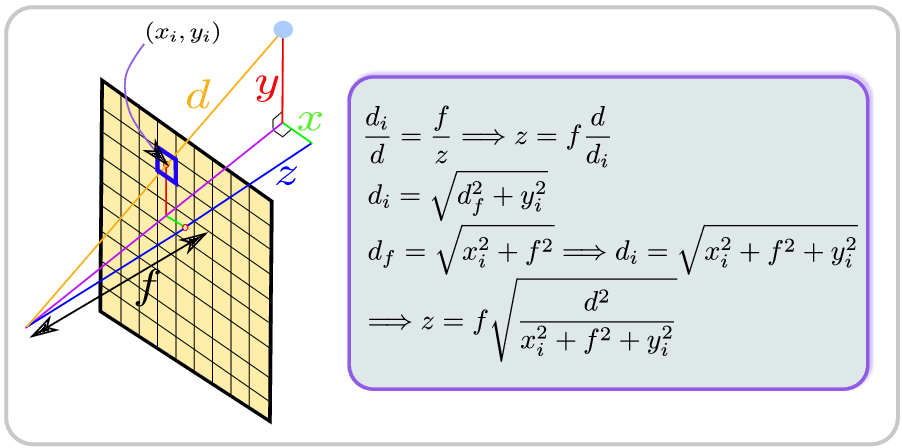

# Reading POVRay Native Format

We provide source files for parsing the ICL-NUIM format data uploaded on the website, specifically the depth files and camera pose files that are stored both in POVRay native format as well as TUM RGB-D format. The ICL-NUIM format depth files and camera poses are stored in PNG images and txt files containing the 3x4 ground truth pose. The POVRay native format has the euclidean distances of 3D points from the camera stored in a file with .depth extension. These euclidean values have to be converted to z-coordinate to be used as depth in the image alignment algorithms. The image below explains the conversion of euclidean distance to depth values.

